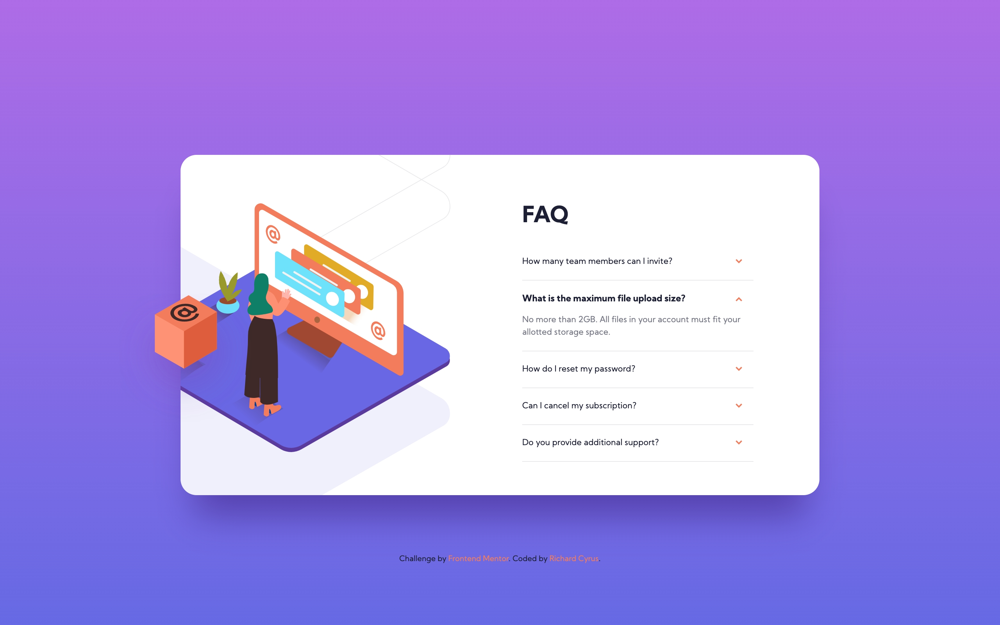

# Frontend Mentor - FAQ accordion card solution

This is a solution to the [FAQ accordion card challenge on Frontend Mentor](https://www.frontendmentor.io/challenges/faq-accordion-card-XlyjD0Oam).

## Table of contents

- [Overview](#overview)
  - [The challenge](#the-challenge)
  - [Screenshot](#screenshot)
  - [Links](#links)
- [My process](#my-process)
  - [Built with](#built-with)
  - [What I learned](#what-i-learned)
  - [Useful resources](#useful-resources)
- [Author](#author)
- [Acknowledgments](#acknowledgments)

## Overview

### The challenge

To build out a FAQ accordion card and get it looking as close to the design as possible.

Users should be able to:

- View the optimal layout for the component depending on their device's screen size
- See hover states for all interactive elements on the page
- Hide/Show the answer to a question when the question is clicked

### Screenshot

Original Mobile Design | My Mobile Design
:--:|:--:
 | 

#### Original desktop design

#### My desktop design

### Links

- Solution URL: [Add solution URL here](https://your-solution-url.com)
- Live Site URL: [Add live site URL here](https://your-live-site-url.com)

## My process

- Start with styling the page for those cases where there is no JavaScript.
  - Build the mobile view first.
  - Build the desktop view second.
- Add JavaScript to enable the accordion functionality.
- Test and style the Accordion.

### Built with

- Semantic HTML5 markup
- CSS custom properties
- Flexbox
- CSS Grid
- Mobile-first workflow
- CSS transitions

### What I learned

- Accessible markup for an accordion component.
- Positioning the mobile image was a a bit of a challenge. The supplied asset has an extra 30 pixel on the left which made it hard to match the design. To fix the problem, I wrapped the image in a flex container set to `justify-content: center;` and added `margin-left: -30px;` to the image.
- The JavaScript used to enable the accordion functionality is based on the script from Scott O'Hara, with the original located [here](https://github.com/scottaohara/a11y_accordions).

### Useful resources

- [How do you mark up an accordion?](https://www.sarasoueidan.com/blog/accordion-markup/)
- [The details and summary elements](https://www.scottohara.me/blog/2018/09/03/details-and-summary.html)
- [Accordion](https://davatron5000.github.io/a11y-nutrition-cards/components/accordion)
- [Accessible ARIA Accordions](https://www.scottohara.me/blog/2017/10/25/accordion-release.html)
- [Accessible accordions & disclosure widgets](https://github.com/scottaohara/a11y_accordions)
- [Collapsible Section](https://inclusive-components.design/collapsible-sections/)
- [Accordion WAI-ARIA Authoring Practices](https://www.w3.org/TR/wai-aria-practices-1.1/#accordion)
- [A Modern CSS Reset](https://piccalil.li/blog/a-modern-css-reset/)

## Author

- Website - [Richard Cyrus](https://www.richardcyrus.com)
- Frontend Mentor - [@richardcyrus](https://www.frontendmentor.io/profile/richardcyrus)
- Twitter - [@techmanrc](https://www.twitter.com/techmanrc)

## Acknowledgments

[@LadyMarian](https://www.frontendmentor.io/profile/LadyMarian) - Her markup for the images provided the inspiration for my implementation.
